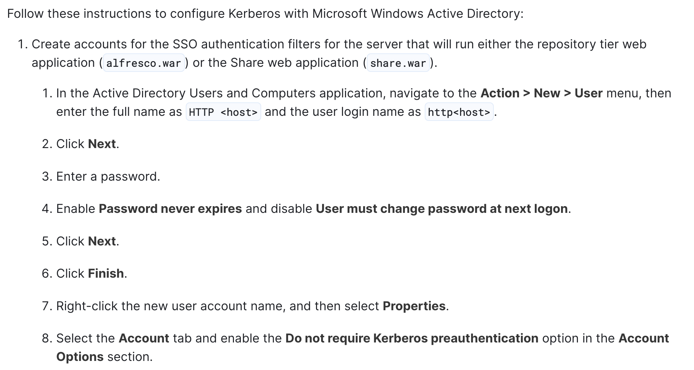

# Forest

## Overview

A domain controller created by _HackTheBox_ with Exchange server installed in a minimal AD domain.

The machine covers the following techniques:

* [ASREPRoasting](../../../windows/auth/kerberos.md#asreproasting)
* [DCSync attack](../../../windows/auth/credential/credential\_dumping.md#dcsync-attack)
* Bloodhound

## Reconnaissance

### Port Scanning

We use `nmap` to figure out what services are running on the target.

```bash
$ nmap -Pn -n -sS -p- -T4 --min-rate 1000 <IP>
PORT      STATE SERVICE
53/tcp    open  domain
88/tcp    open  kerberos-sec
135/tcp   open  msrpc
139/tcp   open  netbios-ssn
389/tcp   open  ldap
445/tcp   open  microsoft-ds
464/tcp   open  kpasswd5
593/tcp   open  http-rpc-epmap
3268/tcp  open  globalcatLDAP
3269/tcp  open  globalcatLDAPssl
5985/tcp  open  wsman
9389/tcp  open  adws
```

The results reveal the following information.

* port 88 tells us that this should be a _domain controller_
* port 389 allows us to fetch information about target AD domain via LDAP
* port 5985 may allow us access the target using _WinRM_ later

### LDAP

It seems that we can fetch information about the target AD domain via [LDAP anonymous authentication](../../../windows/ad/infrastructure/ldap.md#anonymous-authentication).

```bash
$ ldapsearch -H ldap://<IP> -x -b 'dc=htb,dc=local'
```

## Initial Access

### Alfresco

From the information gather through anonymous LDAP query, we found a _service account_ named `svc-alfresco`.

To expand our knowledge of the technology used by our client, the next thing to do is to find what third-party service, which shall be AD-integrated, related this account.

By google, we found a product named [Alfresco Content Services](https://docs.alfresco.com/content-services/7.0).

From the configuration, we see that the account related to this service has been configured with _Kerberos pre-authentication_ disable.

<figure><figcaption><p><a href="https://docs.alfresco.com/process-services/latest/config/authenticate/#configuration-steps">Alfresco - Configuration Steps</a></p></figcaption></figure>

This allows us to get the TGT for this account `svc-alfresco`, and conduct the [_ASREPRoasting_](../../../windows/auth/kerberos.md#asreproasting)[ ](../../../windows/auth/kerberos.md#asreproasting)attack to retrieve the account password from the requested TGT.

### ASREPRoasting

### WinRM

We can now login to the target host with the credential we got via [WinRM](../../../windows/execution/remote/winrm.md).

```bash
$ evil-winrm -i forest.htb -u svc-alfresco -p s3rvice
```

## Reference

[DCSync Attack](../../../windows/auth/credential/credential\_dumping.md#dcsync-attack)\
[WinRM](../../../windows/execution/remote/winrm.md)
